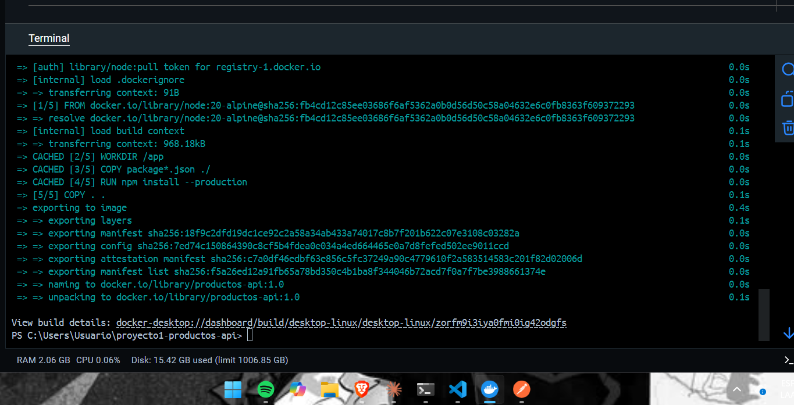
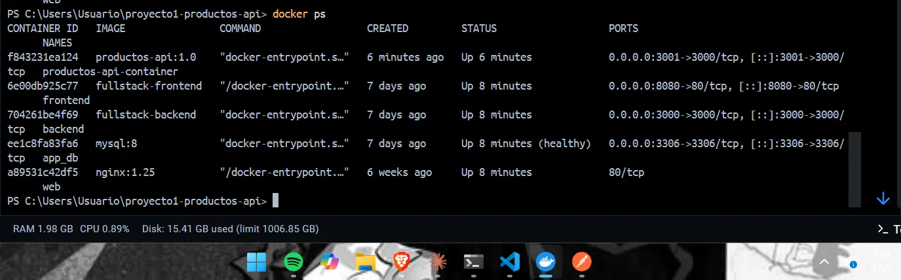
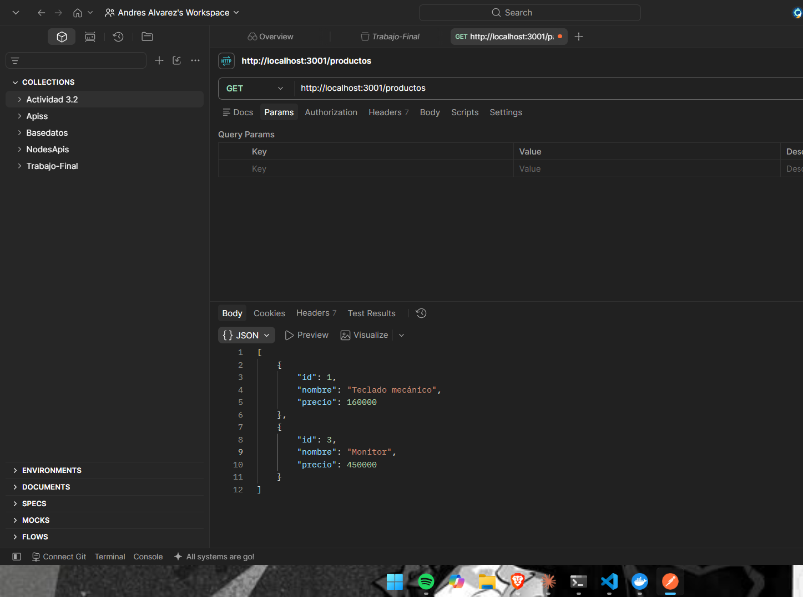
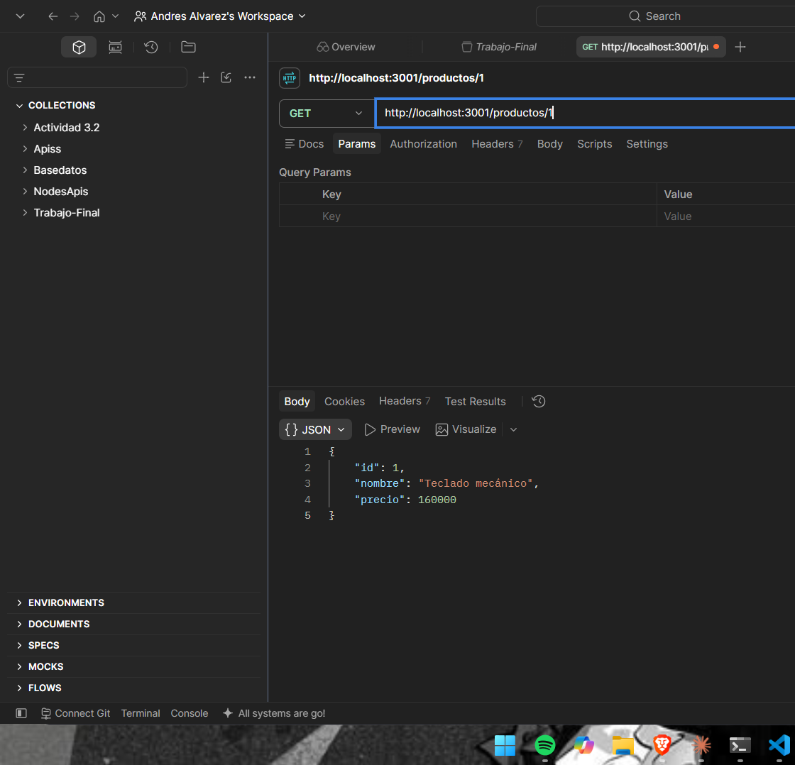
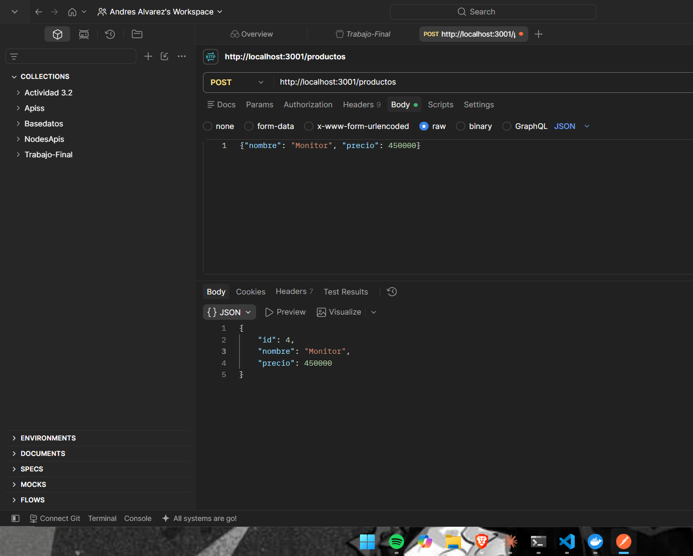
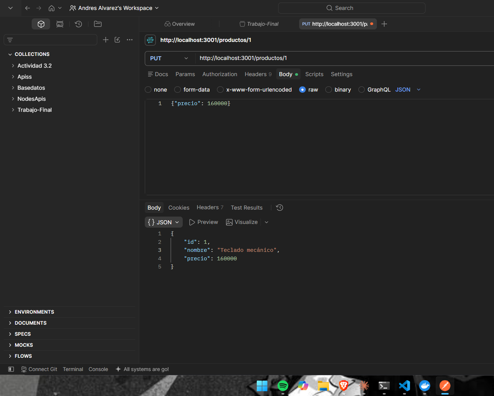
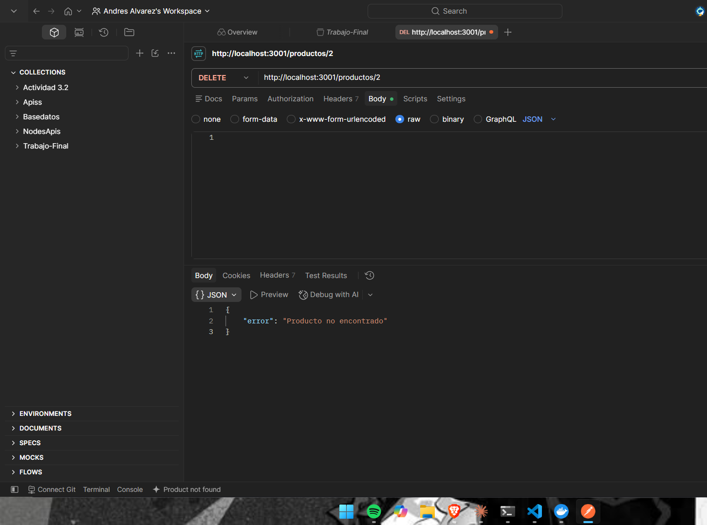

# API de Productos - Proyecto 1 (Docker)

API REST de productos para una tienda virtual, empaquetada en una imagen Docker propia con Node.js y Express.

## Requisitos
- Docker Desktop instalado

## Tecnologías
- Node.js + Express
- Docker (imagen base node:20-alpine)

## Instrucciones de ejecución

### Construir la imagen
docker build -t productos-api:1.0 .

### Ejecutar el contenedor
docker run -d -p 3000:3000 --name productos-api-container productos-api:1.0

### Verificar que está corriendo
docker ps

## Endpoints
| Método | Ruta | Descripción |
|--------|------|-------------|
| GET | /productos | Lista todos los productos |
| GET | /productos/:id | Obtiene un producto por id |
| POST | /productos | Crea un producto |
| PUT | /productos/:id | Actualiza un producto |
| DELETE | /productos/:id | Elimina un producto |

## Evidencias

### docker build

### docker ps

### Endpoints probados en Postman
## Evidencias

